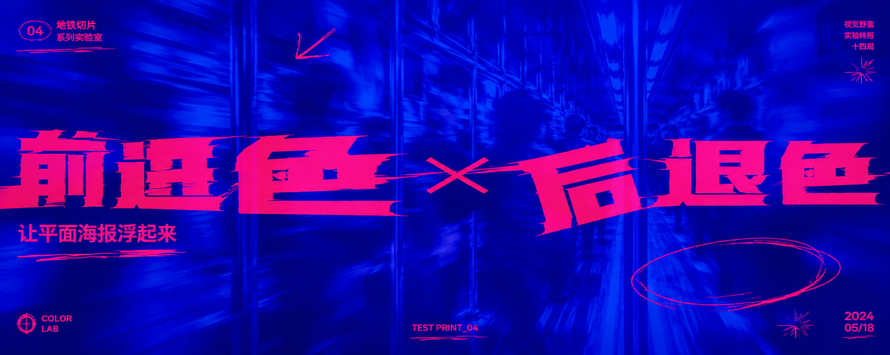

# Image Prompt Skills

一组给 AI Agent 使用的视觉生成 Skills。可以把文章、主题、城市、产品或现有视觉资产，编译成可直接生图的完整提示词。

每个 Skill 都同时提供：

- `SKILL.md`：适合 Codex、Claude Code 等支持 Agent Skills 的工具。
- `ARTICLE-COPY.md`：单文件复制版，适合直接粘贴给 AI。

## 安装

把下面这段话发给支持 Skills 的 AI Agent：

```text
请安装这个仓库里的全部 Skills：
https://github.com/FANzR-arch/image-prompt-skills
```

也可以只安装一个 Skill：

```text
请安装这个 Skill：
https://github.com/FANzR-arch/image-prompt-skills/tree/main/acid-depth-poster
```

## 可用 Skills

| 视觉方向 | Skill ID | 适合内容 |
| --- | --- | --- |
| 现代旅行拼贴明信片 | [`travel-postcard-agent`](travel-postcard-agent/) | 城市、节日、季节、旅行纪念和地点文化 |
| 瑞士国际主义海报 | [`swiss-typographic-poster`](swiss-typographic-poster/) | 字体主导、网格排版、编辑设计和理性视觉 |
| 包豪斯视觉生成 | [`bauhaus-visual-prompt`](bauhaus-visual-prompt/) | 文章封面、正文配图、海报和室内照片重绘 |
| Plakatstil 商品海报 | [`plakatstil-prompt-compiler`](plakatstil-prompt-compiler/) | 商品、包装、服务、品牌物体和德国广告海报 |
| 新粗野主义视觉 | [`neo-brutalist-prompt-compiler`](neo-brutalist-prompt-compiler/) | AI、产品、技术项目、教程和强组件感封面 |
| 前进色 × 后退色实验海报 | [`acid-depth-poster`](acid-depth-poster/) | Y2K、Acid Graphics、夜间城市、青年文化和地下传单 |
| 视觉身份扩展 | [`visual-identity-expander`](visual-identity-expander/) | Logo、头像、IP、插画和产品图的成套视觉延展 |

## 风格样例

| | | |
|:---:|:---:|:---:|
| [](travel-postcard-agent/) | [](swiss-typographic-poster/) | [](bauhaus-visual-prompt/) |
| 现代旅行拼贴明信片 | 瑞士国际主义海报 | 包豪斯视觉生成 |
| [](plakatstil-prompt-compiler/) | [](neo-brutalist-prompt-compiler/) | [](acid-depth-poster/) |
| Plakatstil 商品海报 | 新粗野主义视觉 | 前进色 × 后退色实验海报 |

## travel-postcard-agent

根据城市、节日、季节或特殊主题，生成现代旅行拼贴明信片提示词。

[进入 Skill](travel-postcard-agent/) ｜ [文章复制版](travel-postcard-agent/ARTICLE-COPY.md)

### 使用示例

```text
用 travel-postcard-agent，生成一张杭州中秋主题的旅行拼贴明信片。
```

## swiss-typographic-poster

把瑞士国际主义视觉拆成网格、字体、几何图形和色彩模块，再编译成一条确定性提示词。

[进入 Skill](swiss-typographic-poster/) ｜ [文章复制版](swiss-typographic-poster/ARTICLE-COPY.md)

### 使用示例

```text
用 swiss-typographic-poster，生成一张 5:2 横版文章封面，标题是：结构决定秩序。
```

## bauhaus-visual-prompt

识别文章封面、正文配图、海报或室内重绘需求，生成对应的包豪斯视觉提示词。

[进入 Skill](bauhaus-visual-prompt/) ｜ [文章复制版](bauhaus-visual-prompt/ARTICLE-COPY.md)

### 使用示例

```text
用 bauhaus-visual-prompt，生成一张 4:5 文章封面，标题是：结构比装饰更重要。
```

```text
用 bauhaus-visual-prompt，参考我上传的室内照片，把这个房间重绘成包豪斯风格工作室。
```

## plakatstil-prompt-compiler

把文字主题、商品照片或包装照片，编译成 Plakatstil / Sachplakat 商品广告海报提示词。

[进入 Skill](plakatstil-prompt-compiler/) ｜ [文章复制版](plakatstil-prompt-compiler/ARTICLE-COPY.md)

### 使用示例

```text
用 plakatstil-prompt-compiler，把我上传的商品照片重绘成 Plakatstil 广告海报。
```

## neo-brutalist-prompt-compiler

用粗黑边框、硬阴影、扁平撞色和组件式构图，生成新粗野主义视觉提示词。

[进入 Skill](neo-brutalist-prompt-compiler/) ｜ [文章复制版](neo-brutalist-prompt-compiler/ARTICLE-COPY.md)

### 使用示例

```text
用 neo-brutalist-prompt-compiler，给这个 AI 产品生成一张 16:9 发布封面。
```

## acid-depth-poster

用清晰前景层和模糊后景层制造空间深度，把主题编译成 Y2K / Acid Graphics / 地下传单气质的实验海报提示词。

[进入 Skill](acid-depth-poster/) ｜ [文章复制版](acid-depth-poster/ARTICLE-COPY.md)

### 使用示例

```text
用 acid-depth-poster，生成一张 5:2 横版封面，标题是：前进色 × 后退色。配色使用荧光玫红 × 电光蓝印刷底。
```

## visual-identity-expander

把 Logo、头像、IP、插画或产品图扩展成统一的视觉身份提示词，适合继续制作头像、海报、贴纸、场景和产品化延展。

[进入 Skill](visual-identity-expander/) ｜ [文章复制版](visual-identity-expander/ARTICLE-COPY.md)

### 使用示例

```text
用 visual-identity-expander，分析我上传的 Logo，并扩展成一组统一的品牌视觉提示词。
```

## 目录约定

```text
image-prompt-skills/
├── README.md
└── skill-name/
    ├── SKILL.md
    ├── ARTICLE-COPY.md
    ├── assets/
    ├── references/
    └── evals/
```

`assets/preview.png` 用于 README 风格画廊；没有对应目录时，说明该 Skill 暂时没有公开预览图。

## 当前状态

仓库持续更新中。新增 Skill 时，会同步补充技能总表、调用示例和预览图。
