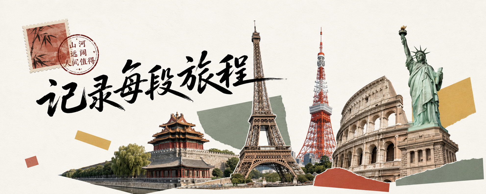
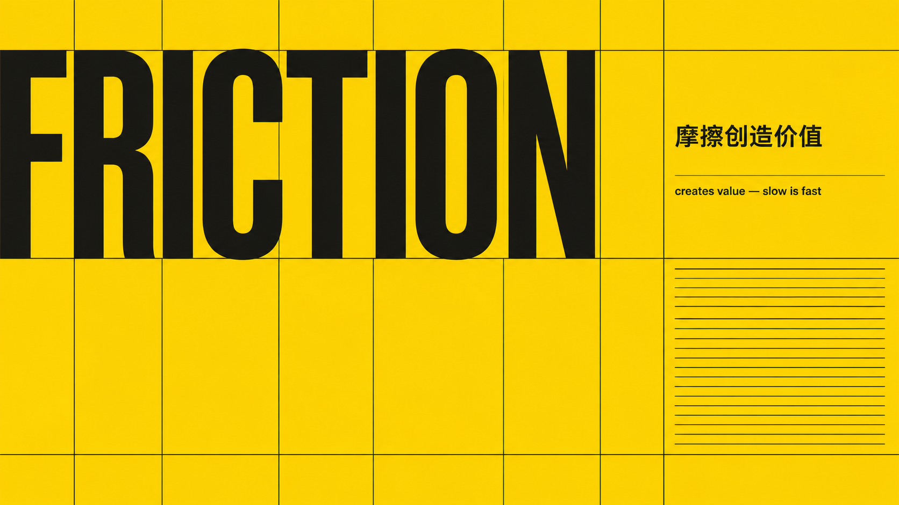
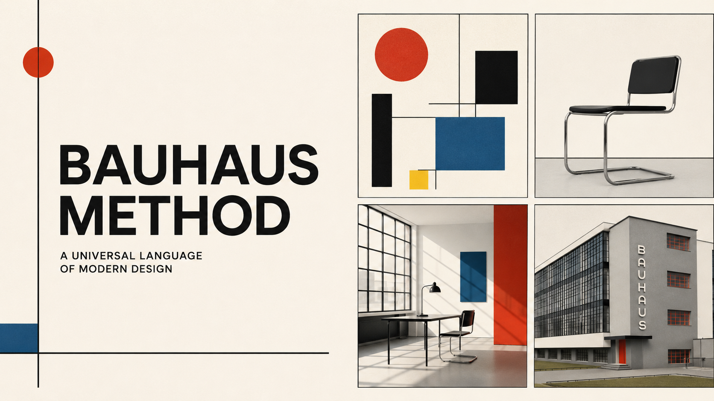
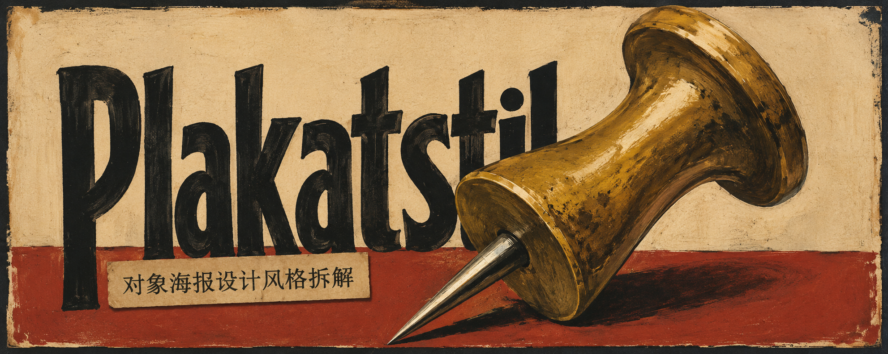

# Image Prompt Skills

一组可复制、可安装、可持续更新的 AI 生图提示词 Skills。

## Skills

### travel-postcard-agent

根据城市、节日、季节或特殊主题生成现代旅行拼贴明信片提示词。
[进入 Skill](https://github.com/FANzR-arch/image-prompt-skills/tree/main/travel-postcard-agent) ｜ [文章复制版](travel-postcard-agent/ARTICLE-COPY.md)

<a href="https://github.com/FANzR-arch/image-prompt-skills/tree/main/travel-postcard-agent"></a>

### swiss-typographic-poster

把瑞士国际主义海报封面拆成设计模块，识别意图后编译成一条确定性生图提示词。
[进入 Skill](https://github.com/FANzR-arch/image-prompt-skills/tree/main/swiss-typographic-poster) ｜ [文章复制版](swiss-typographic-poster/ARTICLE-COPY.md)

<a href="https://github.com/FANzR-arch/image-prompt-skills/tree/main/swiss-typographic-poster"></a>

### bauhaus-visual-prompt

把包豪斯视觉语言拆成文章封面、正文配图、海报和室内照片重绘模块，识别媒介后编译成一条确定性生图提示词。
[进入 Skill](https://github.com/FANzR-arch/image-prompt-skills/tree/main/bauhaus-visual-prompt) ｜ [文章复制版](bauhaus-visual-prompt/ARTICLE-COPY.md)

<a href="https://github.com/FANzR-arch/image-prompt-skills/tree/main/bauhaus-visual-prompt"></a>

### plakatstil-prompt-compiler

把文字主题、商品照片或包装照片编译成 Plakatstil / Sachplakat 商品广告海报提示词，先选模块再输出一条确定性提示词。
[进入 Skill](https://github.com/FANzR-arch/image-prompt-skills/tree/main/plakatstil-prompt-compiler) ｜ [文章复制版](plakatstil-prompt-compiler/ARTICLE-COPY.md)

<a href="https://github.com/FANzR-arch/image-prompt-skills/tree/main/plakatstil-prompt-compiler"></a>

### neo-brutalist-prompt-compiler

把文章主题、产品介绍或技术项目编译成新粗野主义（Neubrutalism）提示词：粗黑边框、硬阴影、扁平撞色、组件感构图，三方向路由后输出一条确定性提示词。
[进入 Skill](https://github.com/FANzR-arch/image-prompt-skills/tree/main/neo-brutalist-prompt-compiler) ｜ [文章复制版](neo-brutalist-prompt-compiler/ARTICLE-COPY.md)

<a href="https://github.com/FANzR-arch/image-prompt-skills/tree/main/neo-brutalist-prompt-compiler"></a>

### visual-identity-expander

把 Logo、头像、IP、插画或产品图扩展成统一的五类视觉身份提示词。（预览图待补）
[进入 Skill](https://github.com/FANzR-arch/image-prompt-skills/tree/main/visual-identity-expander) ｜ [文章复制版](visual-identity-expander/ARTICLE-COPY.md)

### acid-depth-poster

把主题编译成前进色×后退色实验海报提示词：清晰前景层＋模糊后景层的双层空间，Y2K / Acid Graphics / 地下传单气质。（预览图待补）
[进入 Skill](https://github.com/FANzR-arch/image-prompt-skills/tree/main/acid-depth-poster) ｜ [文章复制版](acid-depth-poster/ARTICLE-COPY.md)

## 使用方式

### 直接复制给 AI

打开对应 Skill 目录中的 `ARTICLE-COPY.md`，复制全部内容发送给 AI，然后输入城市或主题。

例如：

```text
杭州 中秋
```

```text
横板5:2，生成一张包豪斯风格文章封面，标题是：结构比装饰更重要。
```

### 作为 Agent Skill 安装

支持 Agent Skills 的工具可以使用包含 `SKILL.md` 的完整目录。`references/` 存放按需读取的参考资料，`evals/` 存放测试用例。

例如安装 `bauhaus-visual-prompt/` 后，可以直接输入：

```text
用 bauhaus-visual-prompt，生成一张 4:5 文章封面，标题是：结构比装饰更重要。
```

```text
用 bauhaus-visual-prompt，参考我上传的室内照片，把这个房间重绘成包豪斯风格工作室。
```

```text
用 plakatstil-prompt-compiler，把我上传的商品照片重绘成 Plakatstil / Sachplakat 广告海报。
```

```text
用 acid-depth-poster，给这篇文章做一张横版 16:9 封面，标题是：别等灵感。
```

## 目录约定

```text
image-prompt-skills/
├── README.md
└── skill-name/
    ├── SKILL.md
    ├── ARTICLE-COPY.md
    ├── references/
    ├── assets/        # preview.png 预览图
    └── evals/
```

每个 Skill 同时维护两个版本：

- `SKILL.md`：适合支持 Agent Skills 的工具；
- `ARTICLE-COPY.md`：单文件、自包含，适合放进文章供读者复制。

## Roadmap

- **风格包内加锚点**：`swiss-typographic-poster` 已加入 Lohse / Gerstner / Stankowski / Tschichold 候选锚点，逐个验证后写进预设。
- **多媒介风格包**：`bauhaus-visual-prompt` 已加入封面、正文配图、海报和室内照片重绘四个路由方向，可作为后续 Constructivism / Memphis 等风格包的结构参考。
- **商品广告编译器**：`plakatstil-prompt-compiler` 已加入文字主题、商品照片、包装照片和人物/服务海报四个输入方向，并提供随机主题示例。
- **抽通用编译器（暂缓）**：`compile-contract.md` 的「编译契约 + 字段 schema」与具体风格无关，后续内容丰富后抽成风格无关模板。当前先以单包形态积累。

## 当前状态

仓库处于持续整理阶段，后续会增加更多生图提示词 Skills。
