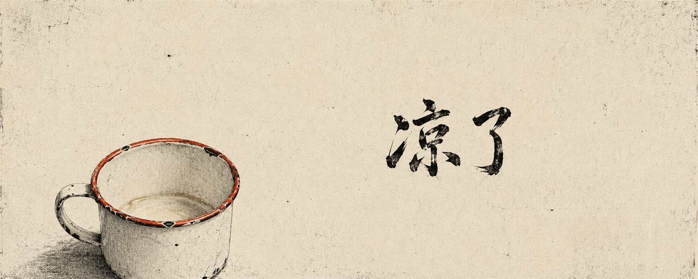
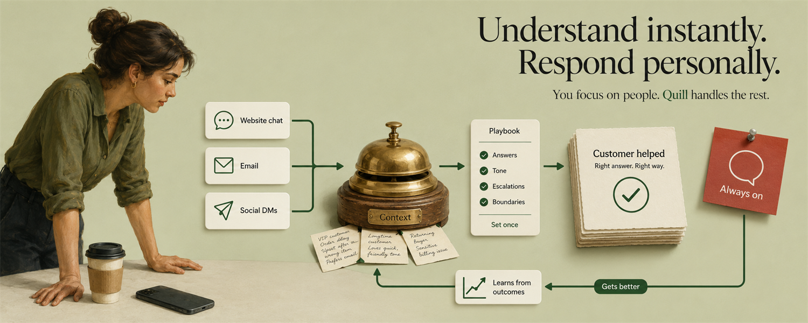
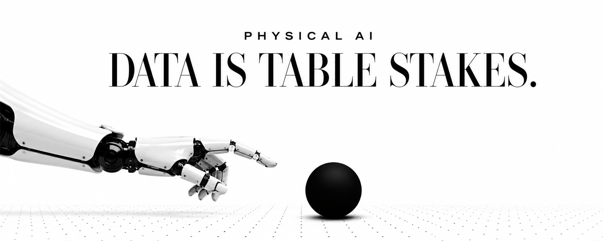
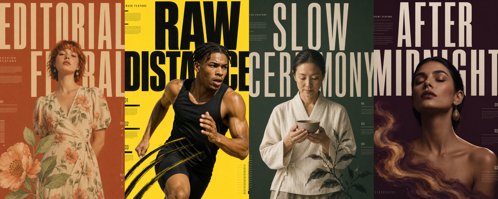
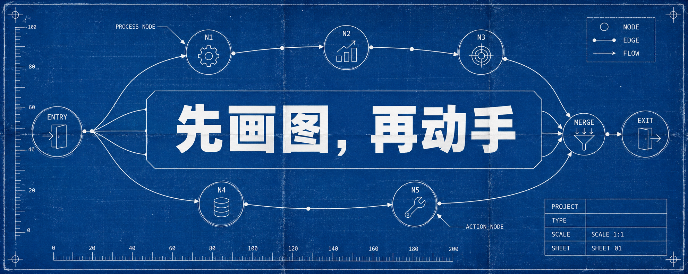
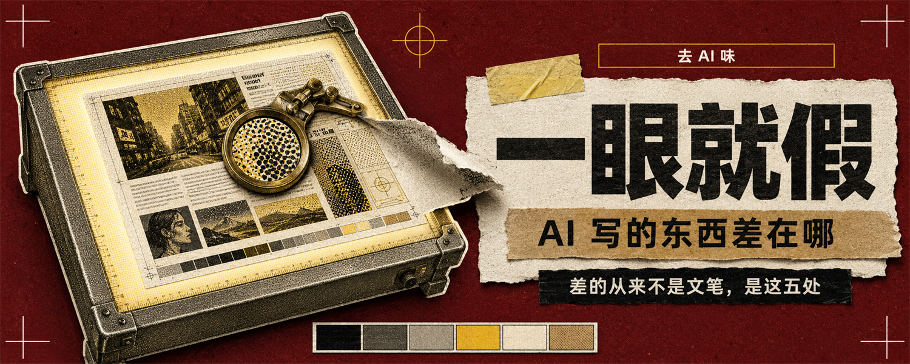
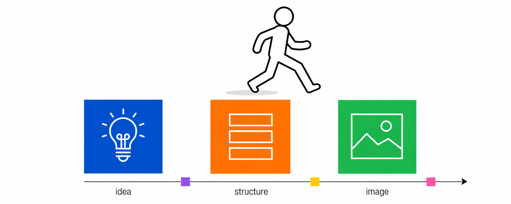

# Phil Design Skills

一组给 AI Agent 使用的视觉生成 Skills。可以把文章、主题、城市、产品或现有视觉资产，编译成可直接生图的完整提示词。

**全部提示词按 gpt-image-2 编写。** 不适用于 Midjourney / Stable Diffusion / Flux——那些模型有 negative 通道、seed 和权重语法，写法不通用。

每个 Skill 提供：

- `SKILL.md`：适合 Codex、Claude Code 等支持 Agent Skills 的工具（全部 Skill 都有）。
- `ARTICLE-COPY.md`：单文件复制版，适合直接粘贴给 AI（部分 Skill 提供）。

中文排版的统一写法见 [`CHINESE-TYPOGRAPHY.md`](CHINESE-TYPOGRAPHY.md)——衬线/无衬线/手写这些类别按主题选，但拉丁专属属性（`monospace` / `uppercase` / `italic` / `grotesk`）对中文无效。

## 安装

把下面这段话发给支持 Skills 的 AI Agent：

```text
请安装这个仓库里的全部 Skills：
https://github.com/FANzR-arch/Phil-design-skills
```

也可以只安装一个 Skill：

```text
请安装这个 Skill：
https://github.com/FANzR-arch/Phil-design-skills/tree/main/acid-depth-poster
```

## 可用 Skills

### 从主题出发

给一个主题、标题、城市或照片，编译成对应风格的提示词。

| 视觉方向 | Skill ID | 适合内容 |
| --- | --- | --- |
| 现代旅行拼贴明信片 | [`travel-postcard-agent`](travel-postcard-agent/) | 城市、节日、季节、旅行纪念和地点文化 |
| 瑞士国际主义海报 | [`swiss-typographic-poster`](swiss-typographic-poster/) | 字体主导、网格排版、编辑设计和理性视觉 |
| 包豪斯视觉生成 | [`bauhaus-visual-prompt`](bauhaus-visual-prompt/) | 文章封面、正文配图、海报和室内照片重绘 |
| Plakatstil 商品海报 | [`plakatstil-prompt-compiler`](plakatstil-prompt-compiler/) | 商品、包装、服务、品牌物体和德国广告海报 |
| 新粗野主义视觉 | [`neo-brutalist-prompt-compiler`](neo-brutalist-prompt-compiler/) | AI、产品、技术项目、教程和强组件感封面 |
| 前进色 × 后退色实验海报 | [`acid-depth-poster`](acid-depth-poster/) | Y2K、Acid Graphics、夜间城市、青年文化和地下传单 |
| 安静纸面标本 | [`quiet-paper-specimen`](quiet-paper-specimen/) | 随笔、情绪、记忆向主题，单物件加大留白加中文手写标题的安静封面 |
| 赛博终端示意图 | [`tech-schematic-poster`](tech-schematic-poster/) | AI 概念、Agent 工作流、技术项目的节点拓扑封面和插图，带三档 CRT 扫描线质感 |
| 工程图纸 | [`engineering-blueprint-sheet`](engineering-blueprint-sheet/) | 产品、流程、结构的蓝图风封面和图纸，四种图面模式配全套制图装置和三档纸张质感 |
| 手作拟物静物 | [`craft-diorama-still-life`](craft-diorama-still-life/) | 用一个实物替一句判断的文章封面和逐章配图 |
| 颗粒棱面风格 | [`grainy-plane-style`](grainy-plane-style/) | 照片改插画风、平涂大色块加细密颗粒的肖像和器物图 |
| 暖纸拟物流程主视觉 | [`paper-workflow-hero`](paper-workflow-hero/) | 产品与服务工作流的官网 hero、营销主图和带真人质感的流程叙事 |
| 黑白编辑横幅 | [`mono-editorial-banner`](mono-editorial-banner/) | 观点长文、判断句和思想类内容的极简黑白超宽封面，中英文标题 |
| 网点 UI 拼贴 | [`halftone-ui-collage`](halftone-ui-collage/) | 工具、工作流和产品类文章的超宽封面：前景坐姿人物、肩后桌面显示器、网点人物配扁平 UI 卡片 |
| 平涂色场杂志封面 | [`flat-field-cover-poster`](flat-field-cover-poster/) | 人物主导的竖版杂志封面，纯平色底配写实人像，超大标题被头肩截断 |
| 立体品牌图标横幅 | [`brand-icon-banner`](brand-icon-banner/) | 平台观察、政策解读和产品判断的超宽封面，立体 App 图标配反白块中文标题 |
| 双色套印拼贴 | [`duotone-press-collage`](duotone-press-collage/) | 一篇文章配一张封面加若干章节图，网点剪贴实物加一件连接物把判断画出来 |
| 简笔人说明插图 | [`outline-figure-explainer`](outline-figure-explainer/) | 概念、流程和对比的解释性插图，白底扁平撞色块配粗黑描边简笔人，可成组 |

### 从已有的视觉资产出发

手上已经有 Logo、头像、角色或产品图，围绕它做成套延展。风格由这张图决定，不预设。

| 用途 | Skill ID | 输入 |
| --- | --- | --- |
| 视觉身份延展 | [`visual-identity-expander`](visual-identity-expander/) | Logo、人物头像、个人形象、IP 角色、插画、产品照片或标志性物件 |

## 风格样例

| | | |
|:---:|:---:|:---:|
| [](travel-postcard-agent/) | [](swiss-typographic-poster/) | [](bauhaus-visual-prompt/) |
| 现代旅行拼贴明信片 | 瑞士国际主义海报 | 包豪斯视觉生成 |
| [](plakatstil-prompt-compiler/) | [](neo-brutalist-prompt-compiler/) | [](acid-depth-poster/) |
| Plakatstil 商品海报 | 新粗野主义视觉 | 前进色 × 后退色实验海报 |
| [](craft-diorama-still-life/) | [](tech-schematic-poster/) | [](grainy-plane-style/) |
| 手作拟物静物 | 赛博终端示意图 | 颗粒棱面风格 |
| [](quiet-paper-specimen/) | [](paper-workflow-hero/) | [](mono-editorial-banner/) |
| 安静纸面标本 | 暖纸拟物流程主视觉 | 黑白编辑横幅 |
| [](halftone-ui-collage/) | [](flat-field-cover-poster/) | [](brand-icon-banner/) |
| 网点 UI 拼贴横幅 | 平涂色场杂志封面 | 立体品牌图标横幅 |
| [](engineering-blueprint-sheet/) | [](duotone-press-collage/) | [](outline-figure-explainer/) |
| 工程图纸 | 双色套印拼贴 | 简笔人说明插图 |

## travel-postcard-agent

根据城市、节日、季节或特殊主题，生成现代旅行拼贴明信片提示词。


[进入 Skill](travel-postcard-agent/) ｜ [文章复制版](travel-postcard-agent/ARTICLE-COPY.md)

### 使用示例

```text
用 travel-postcard-agent，生成一张杭州中秋主题的旅行拼贴明信片。
```

## swiss-typographic-poster

把瑞士国际主义视觉拆成网格、字体、几何图形和色彩模块，再编译成一条确定性提示词。


[进入 Skill](swiss-typographic-poster/) ｜ [文章复制版](swiss-typographic-poster/ARTICLE-COPY.md)

### 使用示例

```text
用 swiss-typographic-poster，生成一张 5:2 横版文章封面，标题是：结构决定秩序。
```

## bauhaus-visual-prompt

识别文章封面、正文配图、海报或室内重绘需求，生成对应的包豪斯视觉提示词。


[进入 Skill](bauhaus-visual-prompt/) ｜ [文章复制版](bauhaus-visual-prompt/ARTICLE-COPY.md)

### 使用示例

```text
用 bauhaus-visual-prompt，生成一张 4:5 文章封面，标题是：结构比装饰更重要。
```

```text
用 bauhaus-visual-prompt，参考我上传的室内照片，把这个房间重绘成包豪斯风格工作室。
```

## plakatstil-prompt-compiler

把文字主题、商品照片或包装照片，编译成 Plakatstil / Sachplakat 商品广告海报提示词。


[进入 Skill](plakatstil-prompt-compiler/) ｜ [文章复制版](plakatstil-prompt-compiler/ARTICLE-COPY.md)

### 使用示例

```text
用 plakatstil-prompt-compiler，把我上传的商品照片重绘成 Plakatstil 广告海报。
```

## neo-brutalist-prompt-compiler

用粗黑边框、硬阴影、扁平撞色和组件式构图，生成新粗野主义视觉提示词。


[进入 Skill](neo-brutalist-prompt-compiler/) ｜ [文章复制版](neo-brutalist-prompt-compiler/ARTICLE-COPY.md)

### 使用示例

```text
用 neo-brutalist-prompt-compiler，给这个 AI 产品生成一张 16:9 发布封面。
```

## acid-depth-poster

用清晰前景层和模糊后景层制造空间深度，把主题编译成 Y2K / Acid Graphics / 地下传单气质的实验海报提示词。


[进入 Skill](acid-depth-poster/) ｜ [文章复制版](acid-depth-poster/ARTICLE-COPY.md)

### 使用示例

```text
用 acid-depth-poster，生成一张 5:2 横版封面，标题是：前进色 × 后退色。配色使用荧光玫红 × 电光蓝印刷底。
```

## quiet-paper-specimen

大留白陈纸背景、单一主体、中文手写大标题、一个落在主体上的高饱和色点，编译成「安静纸面标本」封面提示词。核心意象从十大家族的意象库里选，避免每张都退回叶子和旧照片。


[进入 Skill](quiet-paper-specimen/)

### 使用示例

```text
用 quiet-paper-specimen，把这段随笔做成一张留白封面：那年冬天我没有寄出的信。
```

```text
用 quiet-paper-specimen，做一张 5:2 横版封面，标题用中文手写：凉了。
```

## tech-schematic-poster

用节点-连线拓扑图作主视觉，配 HUD 边框、图例、标尺和系统日志，编译成工程蓝图 / 赛博终端风格的封面和插图提示词。图上另盖一层可调强度的 CRT 屏幕质感——横向扫描线、荧光颗粒、辉光溢出、屏幕弧度、刷新亮带和老化重影，三档强度，整篇统一。


[进入 Skill](tech-schematic-poster/)

### 使用示例

```text
用 tech-schematic-poster，给这篇讲多 Agent 分工的文章做一张 5:2 封面，标题是：从 Loop 到 Graph。
```

```text
用 tech-schematic-poster，同一篇再出 5 张 16:9 插图，屏幕质感上 CRT-03，要旧显像管那种年代感。
```

## engineering-blueprint-sheet

按制图规范画一张真的工程图纸：线型分级（粗轮廓 / 细尺寸线 / 点划中心线 / 虚线隐藏线）、带箭头的尺寸标注、气泡编号、右下角填满字段的标题栏和修订表。四种图面模式——流程拓扑、三视图、爆炸图、详图剖面；三种纸张——晒图蓝底白线、白纸蓝线、陈年棕黄；三档纸张质感，最重的一档带水渍、图钉孔和红笔批注。

和 `tech-schematic-poster` 的分工：那个是发光的屏，这个是印出来的纸。


[进入 Skill](engineering-blueprint-sheet/)

### 使用示例

```text
用 engineering-blueprint-sheet，做一张 5:2 封面，标题是：先画图，再动手。
```

```text
用 engineering-blueprint-sheet，把这个产品画成 3:2 的三视图图纸，纸张用陈年棕黄，质感上 PRINT-03。
```

## craft-diorama-still-life

用剪纸、手作微缩和轻拟物质感，把一篇内容最强的那句判断压进一个实物里，编译成封面和逐章配图提示词。调色板是角色制的，可以直接填自己的品牌色。


[进入 Skill](craft-diorama-still-life/) ｜ [文章复制版](craft-diorama-still-life/ARTICLE-COPY.md)

### 使用示例

```text
用 craft-diorama-still-life，给这篇文章做一张 5:2 封面，标题用中文。
```

```text
用 craft-diorama-still-life，品牌色是 #D64545，这篇每一节都配一张 16:9 章节图。
```

## grainy-plane-style

平涂大色块加细密颗粒，颗粒只落在主体、背景保持绝对干净。既能把一张照片整段改成插画风，也能不用照片、只给主题就出封面和插图。


[进入 Skill](grainy-plane-style/) ｜ [文章复制版](grainy-plane-style/ARTICLE-COPY.md)

### 使用示例

```text
用 grainy-plane-style，把我这张照片改成颗粒棱面风格。
```

```text
用 grainy-plane-style，做一张 2:3 封面，主题是一台老打字机的局部特写。
```

## paper-workflow-hero

奶油纸底上，扁平 UI 卡片、写实拟物道具和半写实绘画人物三种质感共存，用流程图讲「输入→核心→标准→交付→回流」的产品叙事，适合官网 hero 和营销主图。版式、人物调度和桌面道具都做成模块库，成组产出时每张重抽，不会长成一个样。


[进入 Skill](paper-workflow-hero/) ｜ [文章复制版](paper-workflow-hero/ARTICLE-COPY.md)

### 使用示例

```text
用 paper-workflow-hero，给我的 AI 客服产品做一张 5:2 官网主视觉，核心概念是"知识库"。
```

```text
用 paper-workflow-hero，给这五个功能各做一张主视觉，版式和人物都要不一样。
```

## mono-editorial-banner

纯白虚空里放一个写实主体，主体自身带出纯黑作为画面唯一的黑色锚点，超大高反差衬线主标题压在上方，5:2 超宽横板。中英文标题都走衬线（Didone / 高对比宋体）。附一张主体词汇表，把「表面光鲜 vs 底下代价」「看不见的东西在承重」这类关系直接映射成具体装置。


[进入 Skill](mono-editorial-banner/) ｜ [文章复制版](mono-editorial-banner/ARTICLE-COPY.md)

### 使用示例

```text
用 mono-editorial-banner，给这篇文章做一张 5:2 封面，主标题是：TRUST IS INFRASTRUCTURE.
```

```text
用 mono-editorial-banner，中文标题，做一张 5:2 封面：记忆才是护城河。
```

## halftone-ui-collage

暖色平涂底上，前景坐姿的黑白网点人物带白色贴纸描边；一台有真实支架、底座、键盘和鼠标的桌面显示器从人物肩后露出。右侧是扁平矢量 UI 卡片，底角有有机色块和手绘涂鸦，左三分之一压超大无衬线标题，5:2 超宽横幅。人物可叠加克制的抽象抖动颗粒；背景、桌面和色块使用低对比纸张与印刷颗粒，屏幕和卡片保持干净。

标题严格继承用户输入语言：中文输入就全图中文，英文输入就全图英文；一张图不混用中英文。骨架固定、配色寄存器可换，五套寄存器加四张模块表（人物姿态 / 卡片结构 / 屏幕内容 / 主题映射），成组产出每张重抽不会撞脸。


[进入 Skill](halftone-ui-collage/)

### 使用示例

```text
用 halftone-ui-collage，给这篇讲提示词工程的文章做一张 5:2 封面，标题是：WRITING FOR MACHINES。
```

```text
用 halftone-ui-collage，给这篇讲提示词工程的文章做一张 5:2 封面，标题是：提示词系统。
```

## flat-field-cover-poster

一块纯平色底、一个写实人像、一行超大压缩体标题被头肩真实截断、一个手绘元素压在前景下角桥接照片层与图形层，2:3 竖版。照片、平面色块、手绘三种质感同框但各自保持身份。

骨架锁死，变的只有九个槽位。附四张模块表（色场寄存器 / 桥接元素 / 主体机位 / 品类映射）和四条实测成品，成组产出时每张换色场和桥接元素，不会撞脸。

桥接元素有**同源硬约束**：它必须既是主题的物质隐喻，又和主体身上某样东西同源（裙子的水彩印花 ↔ 前景的水彩花枝），并落在光源的对侧下角。这是全套的命门，也是它区别于「照片加大字」的地方。


[进入 Skill](flat-field-cover-poster/)

### 使用示例

```text
用 flat-field-cover-poster，给这篇讲慢生活的文章做一张 2:3 封面，标题是：SLOW / CEREMONY。
```

```text
用 flat-field-cover-poster，给这四个栏目各做一张封面，色场和桥接元素每张换一套。
```

## brand-icon-banner

近白影棚虚空里悬一枚厚圆角立体 App 图标，图标上是**真实品牌 logo**，左侧压三层中文文字——小标签、反白块大标题、灰副标题，全部落在与图标光心同一条水平轴上，5:2 超宽横板。适合平台观察、政策解读和产品判断这类要一眼认出「讲的是哪家」的内容。

带一份 **Logo 协议**：落笔前先调研品牌当前在用的标识版本（品牌会改标、有多套版本），提示词里点名到版本、不拆字形描述、把退役旧标按名封堵进 Constraints——模型的默认值经常停在旧版，X 会出蓝鸟。另附品牌寄存器表（三档明度必须分开给值，否则立体图标塌成色片）和按主题选的道具映射表。

大标题的重音不靠变色，靠**反白块**：纯黑实心圆角矩形加白字，缩略尺寸下仍然读得出。


[进入 Skill](brand-icon-banner/)

### 使用示例

```text
用 brand-icon-banner，给这篇讲 X 创作者分成的文章做一张 5:2 封面，标题是：创作者分成新规则。
```

```text
用 brand-icon-banner，给小红书、抖音、微信这三篇平台观察做成套封面，kicker 统一用「平台观察」。
```

---

## duotone-press-collage

纯色平涂底上贴一组粗网点双色套印的实物剪影，每件带白色刀切描边，角上配裁切线、套版十字线和色条，右下挂一个黑底白字的中文标签块。**为「一篇文章配一张封面加若干章节图」设计**——封面走 5:2，章节图走 16:9，共用同一套基座，成组产出不会撞脸。

两条承重规则。**网点只长在剪贴物上**：平涂色场必须绝对干净，模型的默认行为是把全画面统一成一种质感，不显式排除就一定会长满，这是这套风格既有印刷质感又不脏的唯一原因。**关系要画出来**：每张图必须有且只有一件可见的连接物——绳、纸带、被压下的杠杆、悬空未落的东西、颜色的断点。并置不等于关系，没有连接物的画面是素材摆拍，不是论点。

附七套色寄存器、一张工坊器物母题库、一张连接物库（十种关系各自的写法要点），以及一份回滑封堵清单——器物一旦跨出工坊 / 度量 / 检验家族，整套风格塌成通用复古素材。


[进入 Skill](duotone-press-collage/)

### 使用示例

```text
用 duotone-press-collage，给这篇讲 AI 写作痕迹的文章做一张 5:2 封面，标题是：一眼就假。
```

```text
用 duotone-press-collage，给这篇文章的五个小节各做一张 16:9 章节图，色寄存器每张换一个，标签分别是：三秒露馅、水词堆、太整齐、没代价、只动三处。
```

---

## visual-identity-expander

**这一个从已有的视觉资产出发，风格不预设，从你给的那张图里现场萃取。**

把 Logo、头像、IP、插画或产品图扩展成统一的视觉身份提示词，适合继续制作头像、海报、贴纸、场景和产品化延展。

身份默认双锚——文字化写满、有图时再挂图锚点，所以出来的提示词离开对话仍然能用。附一张载体词汇表，包装和传播场景不会每次都退回马克杯和帆布袋。

[进入 Skill](visual-identity-expander/) ｜ [文章复制版](visual-identity-expander/ARTICLE-COPY.md)

### 使用示例

```text
用 visual-identity-expander，分析我上传的 Logo，并扩展成一组统一的品牌视觉提示词。
```

```text
用 visual-identity-expander，把我上传的头像扩展成一套 X 账号的个人品牌视觉。
```

```text
用 visual-identity-expander，我只要三张贴纸和一张动作设定板，不用出全套。
```

## outline-figure-explainer

纯白底上放圆头无五官的粗黑描边简笔人，配无描边的饱和色块、块内白色细线图标和细黑连接线箭头。把一个概念、流程或对比讲清楚，不做质感也不做光影。可单张也可成组，成组时风格基座逐条重复保证一致。


[进入 Skill](outline-figure-explainer/)

### 使用示例

```text
用 outline-figure-explainer，把「先收敛需求再动手」画成一张说明插图。
```

```text
用 outline-figure-explainer，给这篇文章配四张插图，一组风格要统一。
```

## 目录约定

```text
Phil-design-skills/
├── README.md
├── CHINESE-TYPOGRAPHY.md   # 中文排版共享规范
└── skill-name/
    ├── SKILL.md            # 必有
    ├── references/         # 必有
    ├── assets/             # 「从主题出发」类必有（预览图）
    ├── ARTICLE-COPY.md     # 可选，单文件复制版
    └── evals/              # 可选，测试记录
```

`assets/preview.png` 同时用于顶部风格样例宫格和各 Skill 分节里的示例图，是「从主题出发」那类 Skill 的必备项——它们各自锁定一种风格，预览图就是这个风格的样子。

`visual-identity-expander` 没有 `assets/`，也不需要有：它的成品长什么样由用户上传的图决定，放任何一张预览都会暗示一种它并不锁定的风格。

## 当前状态

仓库持续更新中。新增 Skill 时，会同步补充技能总表、调用示例和预览图。
